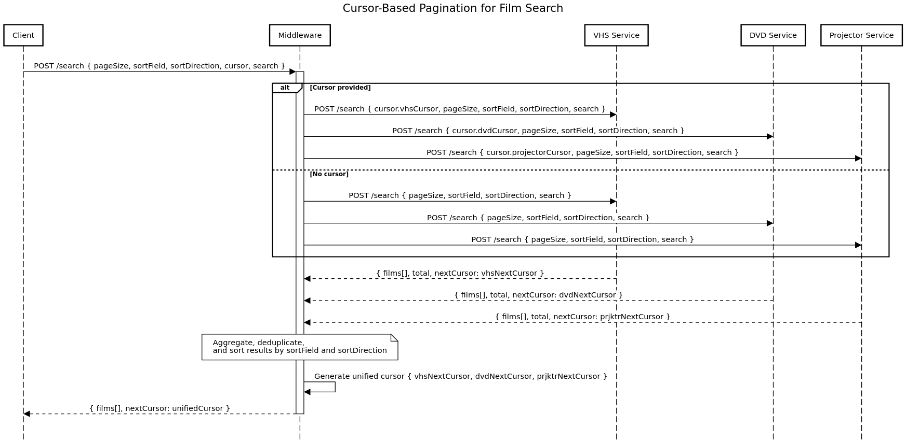

# Assignment

## Start 
- Terminal 1 run ```npm run watch```
- Terminal 2 run ```npm run dev```


## Film Process 

### Design 


### Response 

```
SearchResponse {
    films: Films[],
    nextCursor: {
        vhs: string, 
        projector: string, 
        dvd: string
    }
}
```
